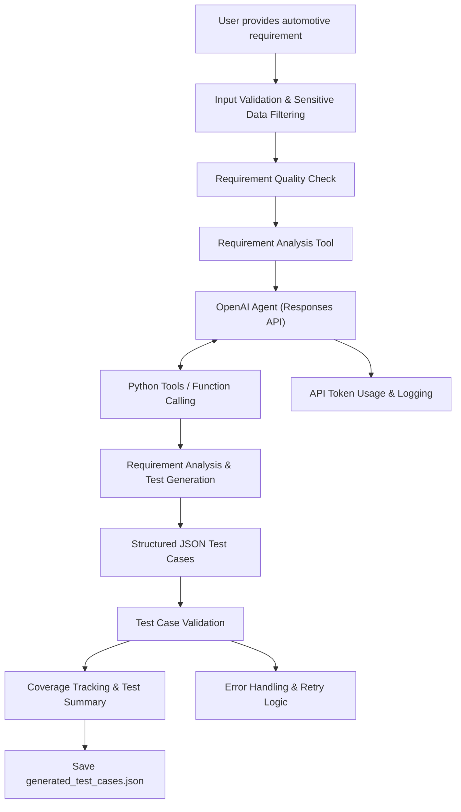

# Automotive Test Case Generator

An AI-powered automotive test case generator built using Python and the OpenAI API. This project converts automotive system requirements into structured test cases to support software testing and validation.

## 1. Project Objective

The objective of this project is to automate the generation of automotive software test cases from natural-language system requirements.

The application uses an AI-powered workflow to analyze requirements and generate functional, negative, and edge test cases in a structured JSON format.

The project demonstrates how Generative AI, Python, and OpenAI tool calling can be applied to automotive software testing and test engineering.

## 2. Technologies Used

- Python
- OpenAI API (Responses API)
- OpenAI function and tool calling
- JSON for structured test case output
- Python standard libraries for validation, logging, and file handling

## 3. Project Workflow

1. The user provides an automotive system requirement.
2. The application validates the input and checks requirement quality.
3. The requirement analysis tool examines the requirement and identifies relevant testing information.
4. The OpenAI-powered agent generates test cases using the defined workflow and tools.
5. The generated test cases are validated against the expected structure.
6. Test case summaries and requirement coverage information are calculated.
7. The generated test cases are saved to a JSON output file.

## 4. Features Implemented

- Requirement input validation.
- Basic sensitive-data filtering.
- Requirement quality checking.
- Requirement analysis using OpenAI tools.
- AI-powered test case generation.
- Structured JSON output validation.
- Functional, negative, and edge test case categorization.
- Requirement coverage tracking using keywords.
- Test case ID tracking for identified requirement coverage.
- Test case summary and category counts.
- API token usage logging.
- API error handling and retry logic.
- Saving generated test cases to `generated_test_cases.json`.

## 5. Example Automotive Requirement

"When the vehicle detects that the driver is approaching another vehicle too quickly, the system shall issue a visual warning to the driver. If the driver does not reduce the vehicle speed and the risk of collision remains high, the system shall automatically apply the brakes to reduce the vehicle speed and help prevent or mitigate a collision."

The application uses this requirement to generate test cases related to visual warnings, collision risk, and automatic braking behavior.

## 6. Output

The application generates structured test cases containing relevant test information, such as:

- Test case ID
- Test scenario and description
- Preconditions
- Test steps
- Expected results
- Test case category

The generated test cases are saved in JSON format for further review and use.

## 7. Limitations

- The quality of generated test cases depends on the clarity and completeness of the input requirement.
- The coverage checker uses keyword-based matching. It provides approximate traceability and cannot guarantee that a test case semantically verifies every requirement.
- The application may generate assumptions when requirements do not specify measurable thresholds, timing constraints, operating conditions, or expected system behavior.
- Generated test cases require review and validation by qualified automotive software and safety engineers before being used in actual vehicle testing.
- This project is an educational prototype and is not a safety-certified automotive validation tool.

## 8. Future Improvements

- Improve semantic requirement coverage using AI-based traceability.
- Add support for identifying missing requirement parameters.
- Introduce automated test case quality scoring based on defined criteria.
- Integrate with test management and CI/CD systems.
- Add support for exporting test cases to additional formats.

## 9. Disclaimer

This project is developed for educational and learning purposes to explore the application of Generative AI in automotive software testing.

The generated test cases must not be treated as proof of vehicle safety, regulatory compliance, or production readiness without appropriate engineering review and validation.

## Architecture

The following diagram illustrates the high-level workflow of the automotive test case generator.

